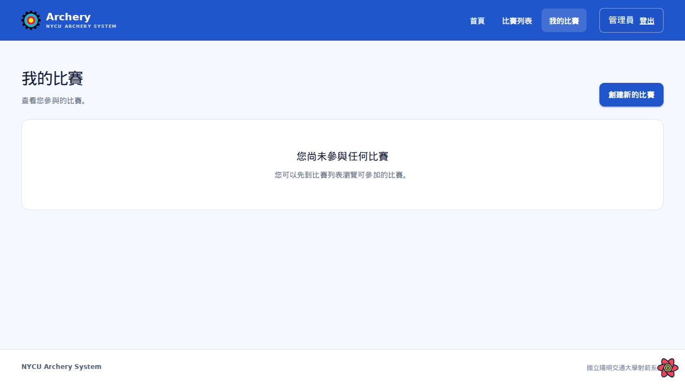
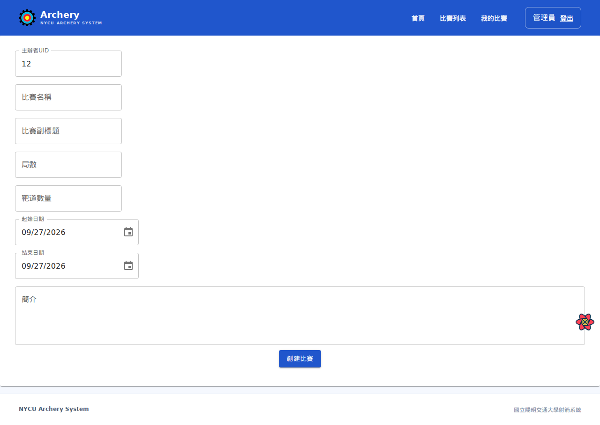
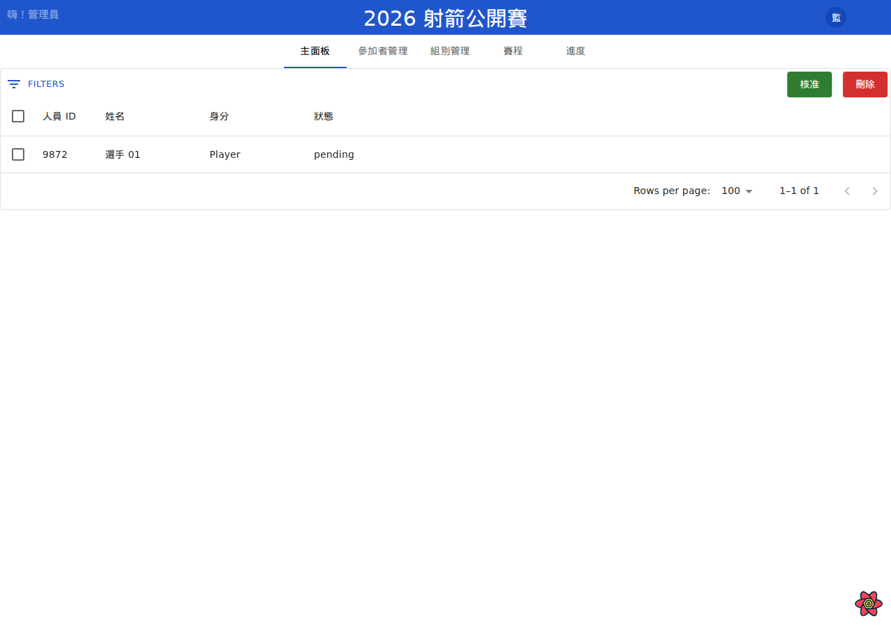
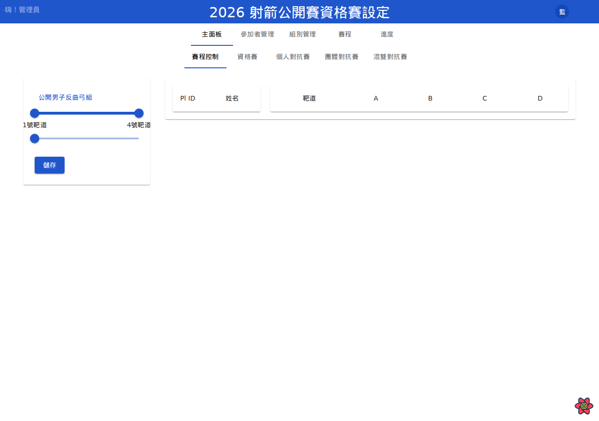
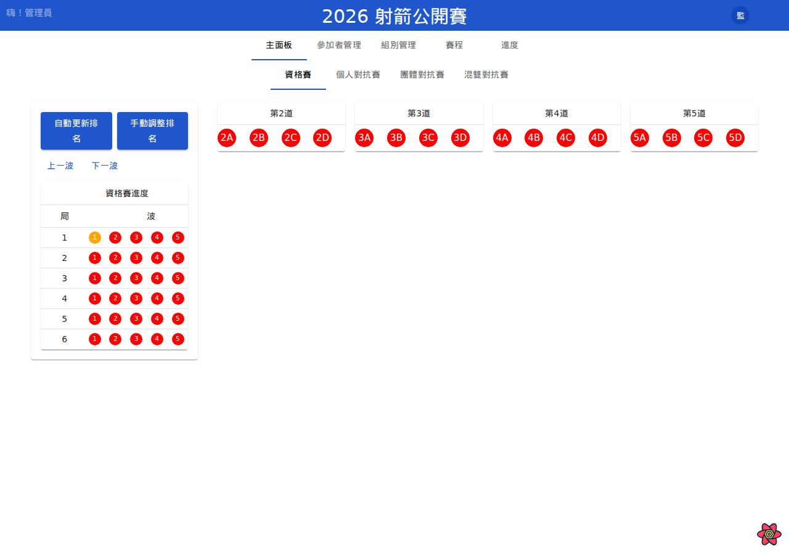
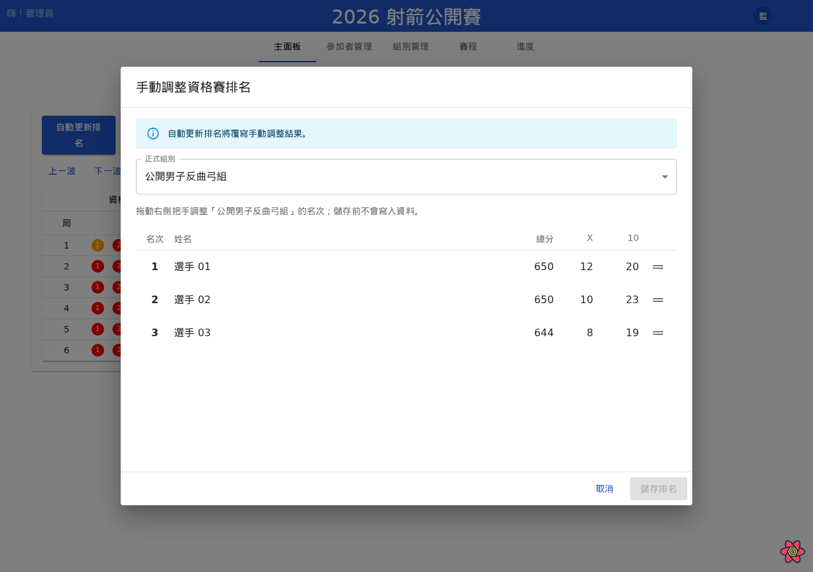
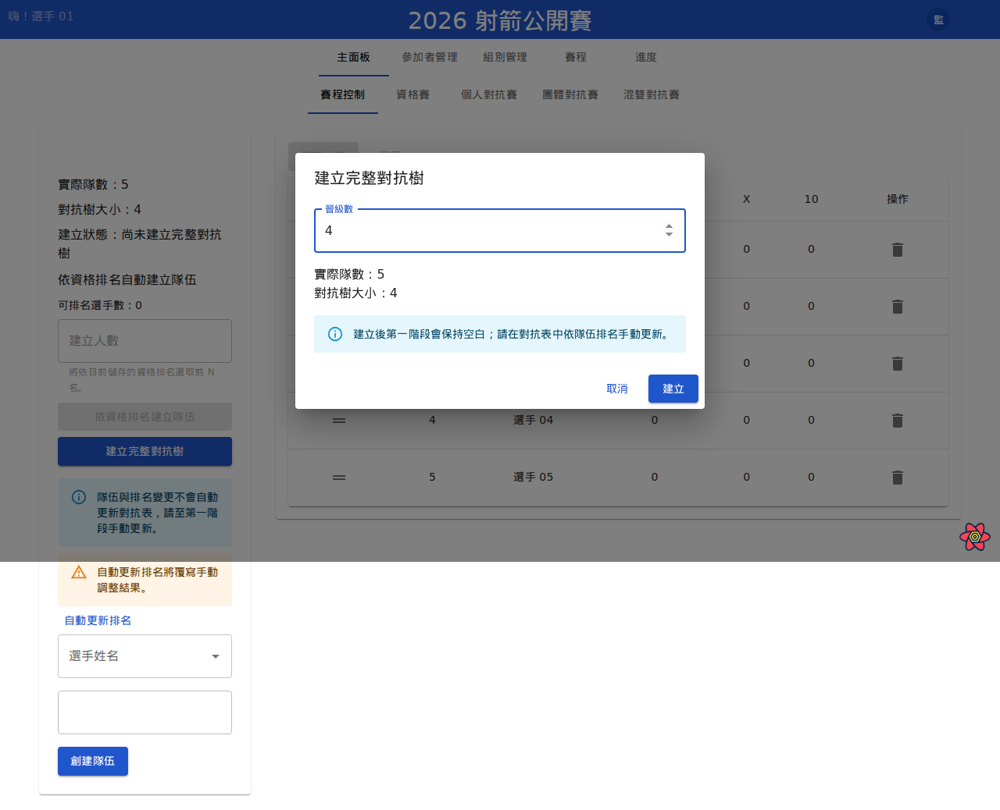
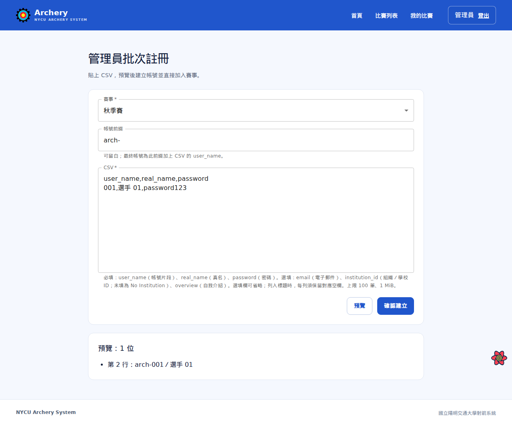

# 管理員使用者手冊

本手冊說明建立賽事、審核申請、配置資格賽、建立對抗賽及推進賽事的操作。建立全新賽事需 Dictator 權限；管理既有賽事需該賽事的 Admin 權限。選手展示名稱統一採「選手 01」格式。

## 建立賽事與準備參賽名單

### 1. 開啟建賽入口

Dictator 登入後開啟「我的比賽」，按「創建新的比賽」。

### 2. 填寫賽事資料

填寫比賽名稱、副標題、局數、靶道數量、日期及簡介，檢查主辦者 UID 後按「創建比賽」。建立完成後進入該賽事的管理頁。

### 3. 審核參賽申請

開啟賽事管理的「參加者管理」。勾選待審核的申請列，確認身分是選手或裁判後按「核准」。選手核准後仍須配置組別與靶道；裁判身分不會自動成為選手。

## 設定資格賽

### 1. 建立正式組別

進入「組別管理」按「創建組別」，填組別名稱、距離與弓種。再將已核准的選手由未分組名單指定到正確正式組別，避免未分組選手進入賽程。

### 2. 設定靶道與晉級名額

進入「賽程」的資格賽設定，選擇正式組別，填寫靶道範圍及晉級名額。將選手配置到靶道與靶面，核對名單後按「儲存」。

### 3. 啟用資格賽並設定選手端階段

在賽程啟用控制開啟「資格賽」。到進度頁的「選手目前畫面」，選擇「資格賽」，讓選手端顯示目前賽別。未啟用的項目不能選取。

### 4. 推進資格賽波次

在「進度」的資格賽頁查看各靶道確認狀態。確認本波應完成的記分都已送出並確認後，按「下一波」；不要在仍有未完成靶道時推進。

### 5. 更新資格賽排名

需要重算名次時按「自動更新排名」。若要人工調整，在資格賽進度頁按「手動調整排名」，選正式組別、拖曳選手列旁的把手，再按「儲存排名」。手動排序會被之後的「自動更新排名」覆寫。

## 建立與推進對抗賽

### 1. 建立隊伍並整理排名

個人賽可按「依資格排名建立隊伍」建立一人隊伍。團體賽先選隊員、輸入隊名，再按「創建隊伍」。完成後按「自動更新排名」依資格賽結果排序；必要時手動調整隊伍排名。

### 2. 建立完整對抗樹

進入對應賽別的「賽程」，按「建立完整對抗樹」，輸入固定晉級數並按「建立」。建立樹、安排首輪隊伍是不同操作；新建樹的首輪會保持空白。

### 3. 安排首輪與靶道

到「進度」的對抗賽頁，選擇組別與賽別，按「依隊伍排名更新第一階段」填入首輪隊伍；需要時按「設定本階段靶道」。更新後檢查每場雙方與靶位，確認同一階段沒有重複隊伍。

### 4. 啟用並切換選手端賽程

在賽程啟用控制開啟對應項目，再於「選手目前畫面」選目前賽別。管理員也可在進度頁選擇要處理的階段與波次。

### 5. 晉級或結算獎牌

對戰比分完成且勝方已確認後，非最後階段按「依結果填入下一階段」。最後階段按「依結果結算獎牌」。重新套用排名可能覆蓋已進行的賽事；若首輪或下游對戰已有結果，系統可能拒絕更新。加射或需裁決的勝方由 Admin 明確指定。

## 批次建立選手帳號

具 Dictator 權限的帳號可用「管理員批次註冊」。

1. 選擇賽事，填帳號前綴及 CSV。
2. 按「預覽」，逐列檢查帳號、選手代稱與錯誤訊息。
3. 修改前綴或 CSV 後重新預覽；有錯誤時「確認建立」不可用。
4. 預覽正確後按「確認建立」，確認建立筆數。

