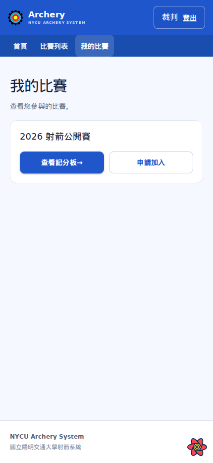
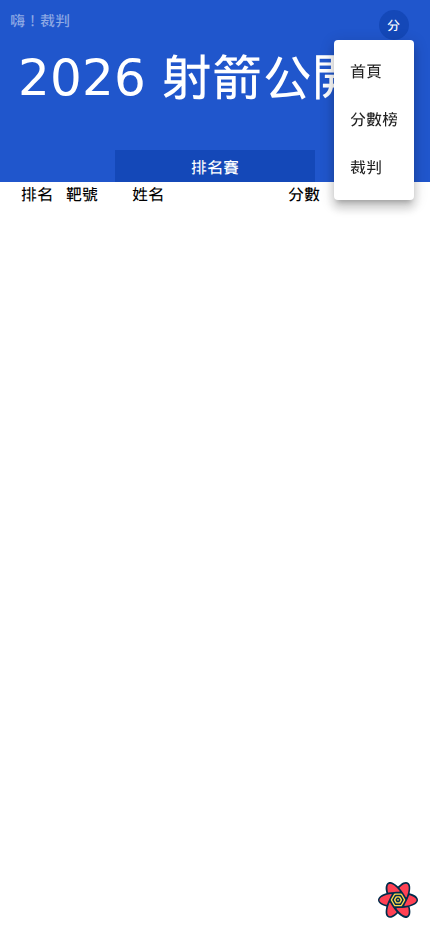
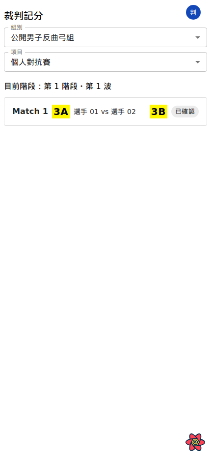
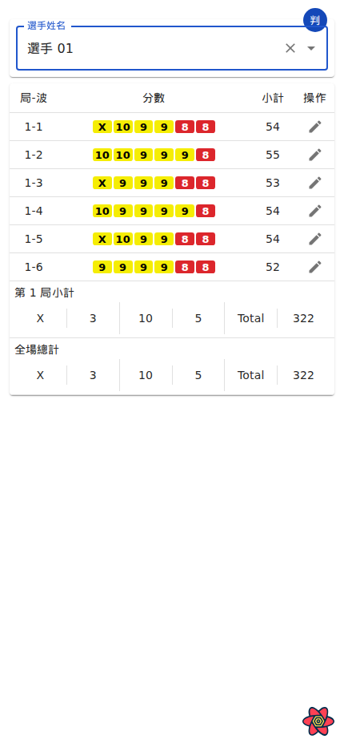
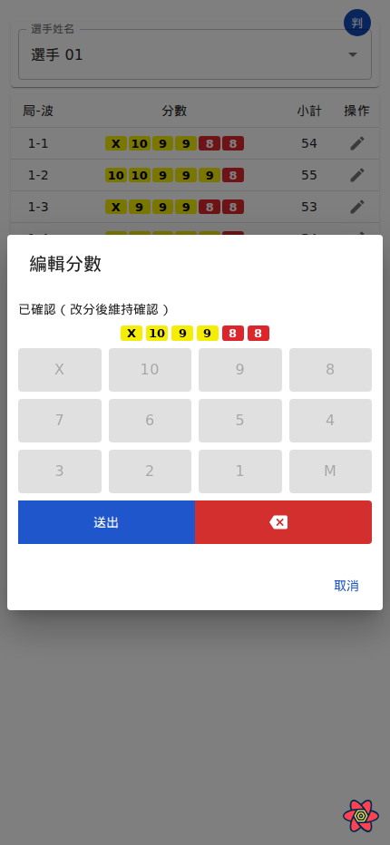
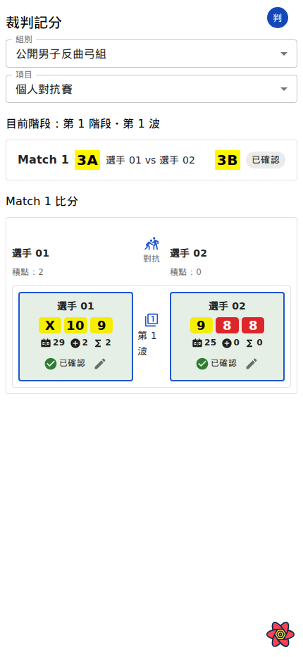
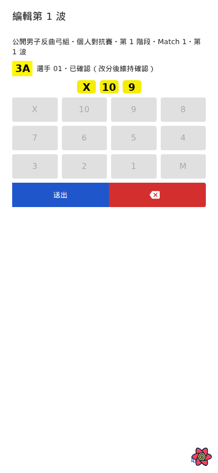

# 裁判使用者手冊

系統網址：https://archery.club.nycu.edu.tw/

本手冊說明如何在手機上選擇賽事範圍、記錄資格賽及對抗賽分數，並更正已確認的波次。申請裁判身分後，須由該賽事管理員核准。圖中的選手皆以「選手 01」格式匿名顯示。

## 進入裁判頁與選擇對象

### 1. 找到要當裁判的賽事

登入後，在「我的比賽」或「比賽列表」找到目標賽事，核對名稱並按「查看記分板」。裁判申請須經該賽事管理員核准，才能進入裁判頁。

### 2. 切換到裁判頁

在賽事頁按右上角的圓形「分」按鈕，從選單選「裁判」。進入後，右上角按鈕會顯示「判」；按它可再次切換頁面。

### 3. 依目前階段找到要處理的對象

賽事在資格賽階段時，裁判頁直接顯示「選手姓名」搜尋欄；選取選手即可查看成績。賽事在對抗賽階段時，先選「組別」及「項目」，再依目前階段與波次點選要處理的 Match。畫面只列出已啟用的對抗賽項目。

## 資格賽記分與更正

### 1. 找到選手並核對波次

在「選手姓名」欄輸入或選取選手。核對組別、靶道、局與波次，並先檢查該波目前的箭分及確認狀態。

### 2. 編輯該波分數

按該波旁的編輯按鈕，在「編輯分數」視窗逐箭輸入正確分數，確認箭格數量與順序後按「送出」。

### 3. 核對儲存結果

送出後確認成績表已更新。裁判可更正已確認的波次；更正成功後該波仍維持已確認狀態，避免已完成波次重新開放。

## 對抗賽記分與更正

### 1. 開啟 Match 比分明細

點選 Match 後，先確認階段、目前波次、我方與對手靶位。雙方比分並排顯示，方便逐波比對。

### 2. 編輯一方該波分數

按要更正一方的該波編輯按鈕，逐箭輸入並按「送出」。雙方分數分開處理；若兩方都需要更正，完成一方後再處理另一方。

### 3. 核對確認狀態

送出後再次核對雙方分數及確認狀態。更正已確認波次後，確認狀態會保留；若尚未送出且要捨棄草稿，按「取消」。

若找不到組別、賽別或 Match，請管理員檢查對抗賽是否已建立。
