# 風城盃選手使用者手冊

系統網址：https://archery.club.nycu.edu.tw/

本手冊介紹登入、申請參賽、資格賽記分、對抗賽記分與查看成績。圖中的選手皆以「選手 01」格式匿名顯示。

小提示：如果遇到任何顯示上的問題，請先嘗試重新整理；如果問題仍然存在，再通知主辦方。

## 登入

至登入頁面輸入帳號：＂nycu29-<靶號>＂／密碼：＂<身分證或居留證後四碼>＂登入。（範例nycu29-23A／6789）

小提示：目前風城盃的選手不需要自己申請加入風城盃，直接進入賽事頁面，並確認自己能進到「紀錄分數」的頁面就好（詳見下一小節）。

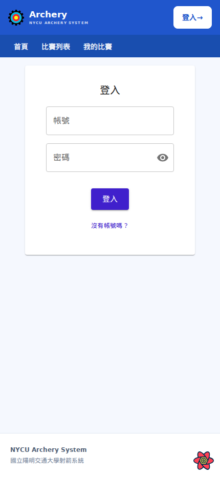

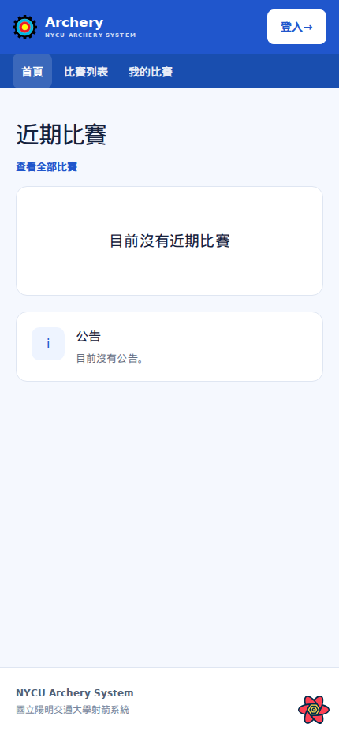

## 進入賽事與切換畫面

### 1. 從列表開啟賽事

登入後，到「我的比賽」找到要參加的賽事；也可從「比賽列表」尋找。核對賽事名稱，按「查看記分板」進入賽事頁。

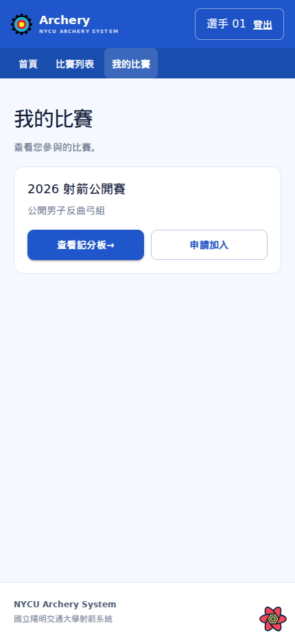

### 2. 確認賽事頁

進入後會先看到該賽事的「分數榜」。核對畫面上的賽事名稱，再選擇要查看的組別與賽別。

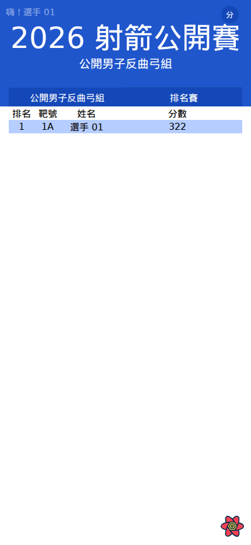

### 3. 切換到記分頁或返回分數榜

按右上角圓形「分」按鈕打開選單，選「紀錄分數」進入記分頁；要返回公開成績，按右上角圓形「記」按鈕，再選「分數榜」。選單中的「首頁」可返回網站首頁。只有選手申請已獲核准，選單才會顯示「紀錄分數」。

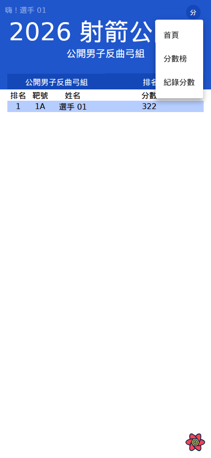

## 資格賽記分

### 1. 開啟記分頁並核對靶道

由賽事頁切到「紀錄分數」，選擇要紀錄的選手。開始輸入前，確認賽事、組別、靶道及目前局、波都正確。
同靶道的選手可以為其他人填寫分數，**一個靶道同時由一位選手填寫就好**。 <!-- 這裡粗體要標紅色警告 -->

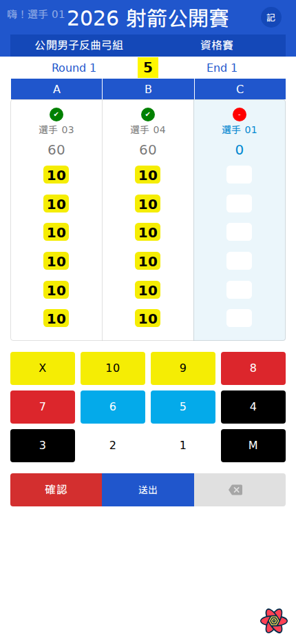

### 2. 逐箭輸入本波分數

按分數鍵逐箭登錄，依畫面顯示的箭格數填完本波。若選錯分數，先使用畫面上的清除或刪除操作修正，再送出。

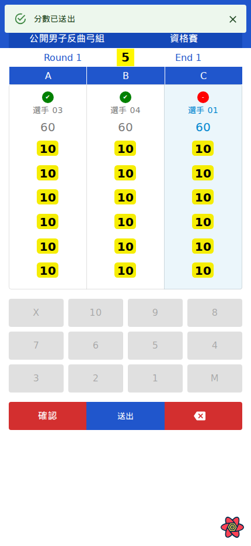

### 3. 送出並確認

每次有選手的分數填滿時，分數都會自動送出該名選手的分數，系統也會跳出提示，也可以手動送出分數。 送出後再按「確認」完成該波。已確認波次不能由選手自行修改；發現錯誤時請裁判或管理員更正。

蘋果裝置目前有個已知問題：使用者按下確認後，畫面上的各個按鈕可能會閃爍，但按下確認後，一樣無法調整該名選手的分數。

## 對抗賽記分

### 1. 核對對局

在「紀錄分數」頁確認目前階段、波次、靶道。選擇要紀錄的隊伍。同個對抗中的選手可以為其他人填寫分數，一個對抗請由一位選手填寫就好。

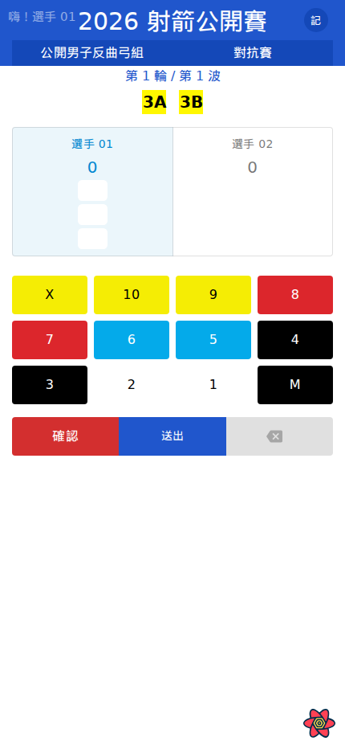

### 2. 輸入並送出本波箭值

按分數鍵逐箭登錄，依畫面顯示的箭格數填完本波。若選錯分數，先使用畫面上的清除或刪除操作修正，再送出。

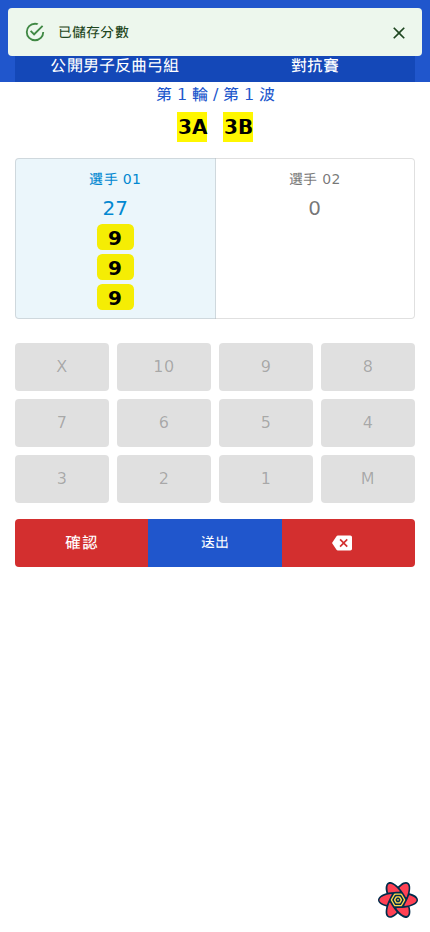

### 3. 確認該波

送出後核對雙方分數，再按「確認」。已確認的波次由裁判或管理員處理更正。

## 查看成績

### 1. 開啟公開記分板

回到比賽列表，在賽事卡按「查看記分板」，選擇組別及賽別。

### 2. 查看資格賽成績

資格賽榜會列出排名與總分。點選選手姓名可查看各局、各波箭值及統計；完整賽事會顯示全部箭值與合計。

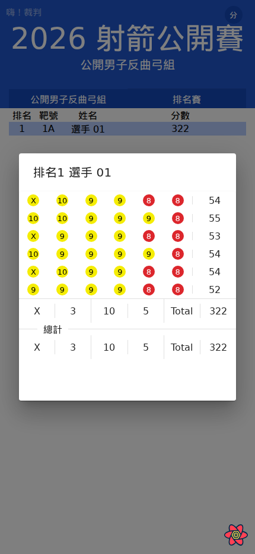

### 3. 查看對抗賽對抗表與單場明細

在手機上可左右滑動對抗表追蹤晉級路徑；隊伍旁黃底數字是靶道。點選隊伍或對局，可查看該場雙方分數、波次資料。

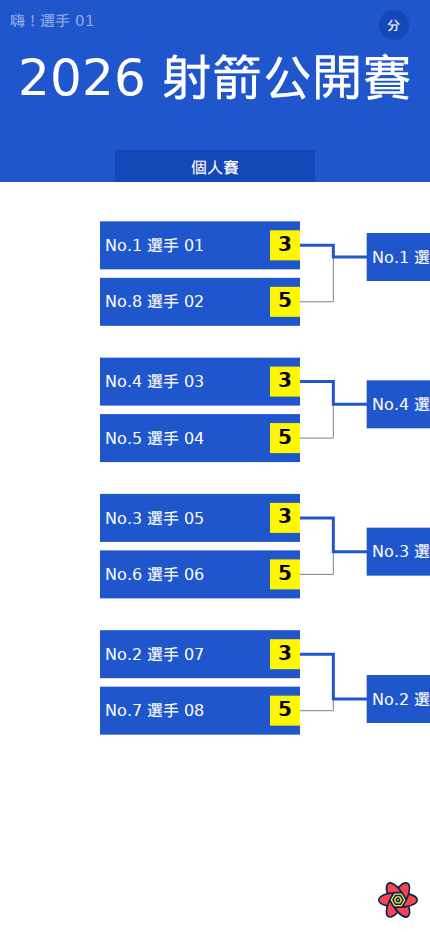

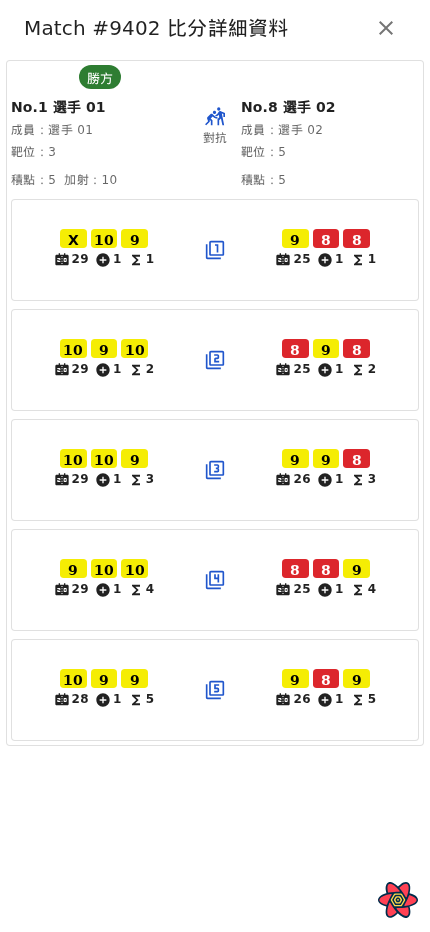
